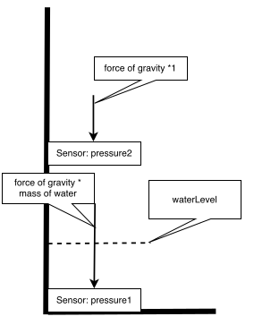

# Protocol 01
#### April 5th 2018

## Ideas

### Softwareside communications

- Python script executed or embedded in the c++ Script that handles the sensors logic.
  - If the script triggers it sends an SMS via a provided API

### Hardwareside concepts


_General concept idea for the sensors functionality (first draft)_

```java
while (true) {
  float deltaPressure = Sensor1 - Sensor2;
  if (deltaPressure > 0) {
    execute(sendMessage.py)
  }
}
```
_General idea pseudocode for an execution script_
